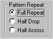

# Choosing the Pattern Repeat{#choosing-the-pattern-repeat}

You can set the Pattern Repeat type for your texture at any time during your editing process.

This option specifies whether the texture image you are editing constitutes a [full repeat, a half-drop repeat, or a half-across repeat.](../c-mrt-texture-image/c-mrt-full-repeat.md#concept-bb0ff94732be439db3af682ca876a1f8)

If you specify a half-drop or half-across repeat style, you can generate a full repeat on the final [!DNL Lighting] tab of the [!DNL Material Repeat] tool.

If you are creating a repeat for use as wallpaper, you don't have to generate a full repeat. You can specify that you are using a half-drop repeat in the [!DNL Texture Material Properties] dialog box in [!DNL Image Authoring].

**To Specify the Pattern Repeat Type:**

* Click **[!UICONTROL Full Repeat]**, **[!UICONTROL Half Drop]**, or **[!UICONTROL Half Across]** under [!DNL Pattern Repeat] at the bottom of the [!DNL Material Repeat] tool.

  

