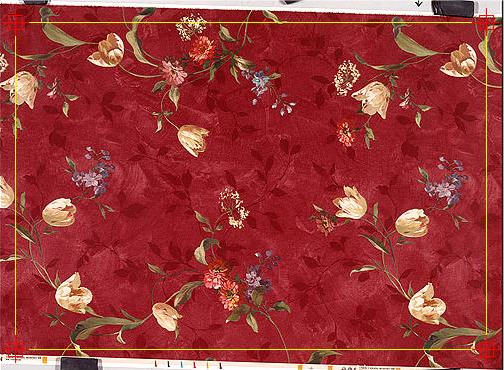
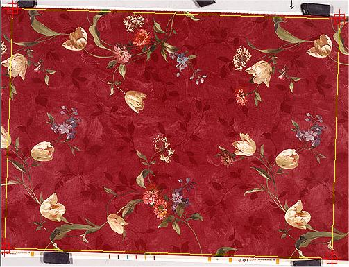
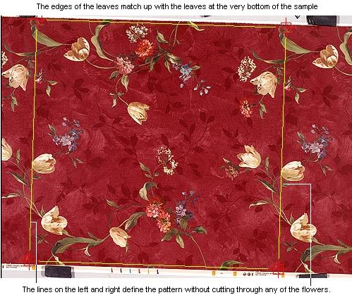

# Using the Perspective Tab{#using-the-perspective-tab}

Start on the **[!UICONTROL Perspective]** tab in the [!DNL Material Repeat] tool, where you do the following:

* Identify the pattern. 
* Check for straightness. 
* Check that repeated items are parallel. 
* Draw a boundary around the repeat

You use the [!DNL Perspective] tab to identify a rectangular region of the sample within the image. You can choose a rectangular region in the pattern itself, or a reference rectangle on the sample's mounting surface. The region you identify must be perfectly rectangular in the original sample, but may be distorted in the image due to the effect of perspective. In the image, the rectangle may be an irregular quadrilateral.

The [!DNL Perspective] tab corrects the image so the quadrilateral becomes a perfect rectangle whose sides are parallel to the horizontal or vertical directions of the image.

The [!DNL Perspective] tab does not apply any clipping to the image, because the rectangle you are defining does not represent the boundaries of the full-tile repeat. It simply adjusts the entire sample to correct the perspective.

**To Define the Repeated Area:** 

1. With the image open in the [!DNL Material Repeat] tool in [!DNL Photoshop], click the **[!UICONTROL Perspective]** tab.
1. Click **[!UICONTROL Axis Align]** to try auto-aligning the image.
1. If you are not satisfied with the auto-aligning results, drag the sides of the rectangle to the perimeters of the sample to see if the edges are straight.

   

1. Hold down the Ctrl key and drag a corner handle to rotate the rectangle until the pattern is straight.

   

1. Find a point in the pattern where you can draw the boundary of the repeat while avoiding cutting through any major pattern elements (if possible).

       

       If you have trouble identifying the boundaries of the repeat, click the [!DNL Lighting] tab and use the [!DNL Highlight Tile Edges] option to see how the pattern tiles.

       Manipulate the rectangle as follows:

    * Uncheck the [!DNL Lock Perspective] checkbox to move the handles in any direction. When this option is checked, you can drag them only within the current perspective, which is flat, by default. If you change the perspective (by rotating), then recheck this option. The handles are constrained to the new perspective. 
    * Hold down the Shift key while you drag a corner handle to move the entire rectangle. 
    * Hold down the Ctrl key while you drag a corner handle to rotate the rectangle about the opposite handle.

1. When the perspective is correct you can move on to the [!DNL Lighting] tab.
