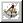

# The Camera Tool{#the-camera-tool}

The Camera tool defines the target the camera was pointing at when the photo was taken.

Setting the camera is the [first step](../../c-vat-3d-mod-pg/c-vat-create-geo/t-vat-cam-mod.md#task-fc39ab753bb248c7a8f86fb27594412e) in defining the 3D geometry.

The [!DNL Camera] tool  has the following options:

* **Show Scene Directions:** Lets you show or hide the [!DNL Scene Directions] (guidelines). 

* **Show Block:** Lets you show or hide the [!DNL Block]. 

* **Block Size:** [Sets the relative sizes](../../c-vat-3d-mod-pg/c-vat-create-geo/t-vat-set-block.md#task-383646d12ec14e84b47d75fad4489175) of the three scene directions. 

* **Camera:** Settings [define the field of view](../../c-vat-3d-mod-pg/c-vat-create-geo/t-vat-set-block.md#task-383646d12ec14e84b47d75fad4489175) for the camera target. 

* **Vanishing Pts:** Displays the number of [directions that are not parallel](../../c-vat-3d-mod-pg/c-vat-create-geo/c-vat-persp-van-pts.md#concept-b8d51c1a3fb647eaa61f7a3e0db5085e) and therefore result in vanishing points.

