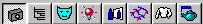
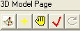

# About the 3D Modeling Page{#about-the-d-modeling-page}

If you plan to show reflections in your vignette, you must create geometry on the 3D Modeling page.

You cannot use 3D geometry with [sketch features](../../c-vat-work-sketch-pg/c-vat-abt-sketch-pg/c-vat-abt-sketch-pg.md#concept-7e6bb452319c45ea9663920dd2f06d85). Sketch features are intended for apparel images and other vignettes that contain flat objects. These features are not intended for three-dimensional objects, such as upholstered furniture.

If you plan to create a 3D vignette, remember to [set the mode to 3D when you create objects](../../c-vat-obj-pg/c-vat-create-grps-obj/t-vat-create-3d-obj.md#task-adac1e1e26024993aa97ed6c7e87c084). You do this after you create geometry.

To create geometry successfully, complete the following steps, in order:

* [Creating a Camera Model](../../c-vat-3d-mod-pg/c-vat-create-geo/t-vat-cam-mod.md#task-fc39ab753bb248c7a8f86fb27594412e) ([setting the scene directions](../../c-vat-3d-mod-pg/c-vat-create-geo/t-vat-set-scene-dir.md#task-ee5d6e4c19e245bd84889f00998a4b85) and [setting the block](../../c-vat-3d-mod-pg/c-vat-create-geo/t-vat-set-block.md#task-383646d12ec14e84b47d75fad4489175)) 

* [Adding Geometry](../../c-vat-3d-mod-pg/c-vat-create-geo/t-vat-add-geo.md#task-21871477506a4daaa695d638cc159dc0) 
* [Defining Scale](../../c-vat-3d-mod-pg/c-vat-create-geo/t-vat-def-3d-scale.md#task-7938e8b9590543a78d48b678d2d26ba9) 
* [Importing Geometry](../../c-vat-obj-pg/c-vat-abt-obj-pg/t-vat-imp-geo.md#task-a6681c3260ee4a57a177366095981ddc)

To go to the [!DNL 3D Modeling] page, click the **[!UICONTROL 3D Modeling Page]** button in the toolbar:

The right side of your screen displays the [!DNL 3D Modeling] tool buttons.

The window at the bottom of the screen is a miniature view of the entire vignette, which you can zoom and pan independent of the main view. Right-click this window to see a menu of options. 

>[!MORE_LIKE_THIS]
>
>* [About the 3D Modeling Page](../../c-vat-3d-mod-pg/c-vat-abt-3d-mod-pg/c-vat-abt-3d-mod-pg.md#concept-93553c563c534d839a5cf0f2aafa70ee)
>* [Navigating in the 3D Modeling Page](../../c-vat-3d-mod-pg/c-vat-abt-3d-mod-pg/r-vat-nav-3d-mod-pg.md#reference-897e38ea1865404e849c216391306c36)
