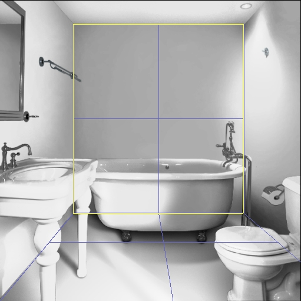

# Adding Geometry{#adding-geometry}

You'll create the basic planes that make up your vignette.

The location of the planes, and their relationship to each other, determine how objects are reflected when you render them.

Planes are infinite, so you don't have to drag them all the way to the edge of the photo.

Use [!DNL Undo] on the [!DNL Edit] menu if you make a mistake, or use the [ [!DNL Clear Geometry]](../../c-vat-3d-mod-pg/c-vat-3d-mod-pg-tools/c-vat-edit-tool.md#concept-9aac032f037f449cbcadecf4890c2a98) option to start over.

**To Create the Geometric Planes:** 

1. Click the **[!UICONTROL Add]** tool .
1. [Zoom in](../../c-vat-3d-mod-pg/c-vat-abt-3d-mod-pg/r-vat-nav-3d-mod-pg.md#reference-897e38ea1865404e849c216391306c36) so you can see the corners of the geometry clearly.
1. Click the intersection of a horizontal and a vertical plane, such as the corner where a wall and floor meet.

   The more accurate you are in selecting the intersection, the more realistic the reflections are. If you can't be exact, it is better to err by clicking a bit higher on the wall than to click too low on the floor.

   When you click, a yellow dot appears. (It disappears when you move the mouse away, but reappears when you mouse over it). 

1. Drag up, down, or horizontally across from the yellow dot to pull one edge of the plane over to another intersection of the wall or surface you're defining.
1. Click anywhere along the line and stretch it to define the plane.

   The plane snaps to the directions you defined with the guidelines. 

1. When you get to a seam, let go of the mouse button.
1. Grab one side of the plane (where the next plane should begin) and drag it to define that plane. Repeat this step until all the planes in the vignette are defined.
1. [Rotate the view](../../c-vat-3d-mod-pg/c-vat-3d-mod-pg-tools/c-vat-rotate-tool.md#concept-d89dd2f2724f4cd2bf6f9570fdf1c8ca) to examine it from different angles and see if there are errors in the camera model.

   Your geometry may seem correct from the photograph's viewpoint, but the proportions may be wrong. Rotate the view to avoid building your geometry on a faulty camera model. If you change the camera, you must also delete any existing geometry and recreate it. 

Once the planes are defined, you can [set the scale](../../c-vat-3d-mod-pg/c-vat-create-geo/t-vat-def-3d-scale.md#task-7938e8b9590543a78d48b678d2d26ba9) of any line segment to determine the relative size of all objects in the vignette.

The following image shows several planes:

To create geometry successfully, complete the following steps, in order:

* [Creating a Camera Model](../../c-vat-3d-mod-pg/c-vat-create-geo/t-vat-cam-mod.md#task-fc39ab753bb248c7a8f86fb27594412e) ([Setting the Scene Directions](../../c-vat-3d-mod-pg/c-vat-create-geo/t-vat-set-scene-dir.md#task-ee5d6e4c19e245bd84889f00998a4b85) and [Setting the Block](../../c-vat-3d-mod-pg/c-vat-create-geo/t-vat-set-block.md#task-383646d12ec14e84b47d75fad4489175)) 

* Adding Geometry 
* [Defining Scale for 3D Images](../../c-vat-3d-mod-pg/c-vat-create-geo/t-vat-def-3d-scale.md#task-7938e8b9590543a78d48b678d2d26ba9) 
* [Importing Geometry](../../c-vat-obj-pg/c-vat-abt-obj-pg/t-vat-imp-geo.md#task-a6681c3260ee4a57a177366095981ddc)

