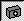
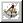

# Creating a Camera Model{#creating-a-camera-model}

In order to scale objects properly and reflect them in shiny surfaces, Image Authoring needs a detailed, three-dimensional model of the scene.

The model is called the geometry of the scene. The geometry must include the major components of the scene, but it does not have to be perfectly accurate.

The first step in creating the geometry is to estimate the relative position, orientation, and field of view of the camera used to photograph the scene (the camera model). Start by setting the guidelines.

** To Define the View Angle and Camera Position for the Image:** 

1. Click the **[!UICONTROL 3D Modeling Page]** button .

   Until you've set up and saved your geometry, clicking this button displays the message, "Please set the camera model manually before building geometry." 

1. Click **[!UICONTROL OK]** on the message window.
1. Click the **[!UICONTROL Camera]** tool .

   You'll see green, red, and blue guidelines, as well as a rectangular block whose sides are parallel to these directions. 

1. Turn off the display of the block while you set the scene directions by unchecking [!DNL Block in the Display] settings in the side menu, but make sure [!DNL Scene Directions] remains checked.

   The rectangular block disappears but the guidelines remain. 

1. Use the instructions in the [Setting the Scene Directions](../../c-vat-3d-mod-pg/c-vat-create-geo/t-vat-set-scene-dir.md#task-ee5d6e4c19e245bd84889f00998a4b85) topic to set the directions.
To create geometry successfully, complete the following steps in order:

* Creating a Camera Model ([Setting the Scene Directions](../../c-vat-3d-mod-pg/c-vat-create-geo/t-vat-set-scene-dir.md#task-ee5d6e4c19e245bd84889f00998a4b85) and [Setting the Block](../../c-vat-3d-mod-pg/c-vat-create-geo/t-vat-set-block.md#task-383646d12ec14e84b47d75fad4489175)) 

* [Adding Geometry](../../c-vat-3d-mod-pg/c-vat-create-geo/t-vat-add-geo.md#task-21871477506a4daaa695d638cc159dc0) 
* [Defining Scale for 3D Images](../../c-vat-3d-mod-pg/c-vat-create-geo/t-vat-def-3d-scale.md#task-7938e8b9590543a78d48b678d2d26ba9) 
* [Importing Geometry](../../c-vat-obj-pg/c-vat-abt-obj-pg/t-vat-imp-geo.md#task-a6681c3260ee4a57a177366095981ddc)

