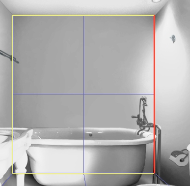

# Defining Scale for 3D Images{#defining-scale-for-d-images}

Image Authoring uses the Pick tool measurement, along with the other geometry information you've defined, to size all the objects in the vignette.

The [!DNL Pick] tool  lets you specify the length of an edge of a plane you've defined. You need define only one line length.

The [!DNL Pick] tool also lets you check the length of any edge based on the current scale, this serves as a useful consistency check.

Once you select this tool, you remain in [!DNL Pick] mode until you click a non-defined area (or the area outside the image).

**To Define Scale:** 

1. Click the **[!UICONTROL Pick]** tool .
1. Click a line segment within a defined plane to select it.

   The line segment thickens and turns red when the cursor is over it.

   

1. Define the length of the real-life version of this segment (in inches) by typing a value in the [!DNL Selected Length] field and clicking **[!UICONTROL Reset]**.

   For example, if the segment represents a wall, type 96 to indicate that the wall is eight feet (or 96 inches) tall. If you are not sure of the real-life size of the objects in your photo, use a kitchen counter height (almost always 36 inches) or a wall (almost always 96 inches). 

Once you have defined the scale, you can [import your geometry](../../c-vat-obj-pg/c-vat-abt-obj-pg/t-vat-imp-geo.md#task-a6681c3260ee4a57a177366095981ddc) and save it with your vignette. You can return to the [!DNL 3D Modeling] page at any time to add or modify geometry.

To successfully create geometry, complete the following steps, in order:

* [Creating a Camera Model](../../c-vat-3d-mod-pg/c-vat-create-geo/t-vat-cam-mod.md#task-fc39ab753bb248c7a8f86fb27594412e) ([Setting the Scene Directions](../../c-vat-3d-mod-pg/c-vat-create-geo/t-vat-set-scene-dir.md#task-ee5d6e4c19e245bd84889f00998a4b85) and [Setting the Block](../../c-vat-3d-mod-pg/c-vat-create-geo/t-vat-set-block.md#task-383646d12ec14e84b47d75fad4489175)) 

* [Adding Geometry](../../c-vat-3d-mod-pg/c-vat-create-geo/t-vat-add-geo.md#task-21871477506a4daaa695d638cc159dc0) 
* Defining Scale 
* [Importing Geometry](../../c-vat-obj-pg/c-vat-abt-obj-pg/t-vat-imp-geo.md#task-a6681c3260ee4a57a177366095981ddc)

