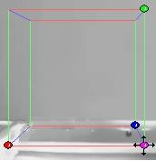

# Setting the Block{#setting-the-block}

You use the geometry block and the camera information provided by the vanishing points to create an accurate camera model before you create the actual geometry.

This is particularly important if your scene contains less than three vanishing points, which is common. To check the number of vanishing points in your scene, look at the [!DNL Vanishing Pts] field in the side menu.

The geometry block consists of 12 lines and 4 circular points. The colored points are called corner handles, and are used to move and resize the block. The sides of the block are parallel to the scene directions. The colors of the lines in the block correspond to the colors of the lines used for the scene directions.

**To Set the Geometry Block:** 

1. Turn on the display of the block by checking [!DNL Block in the Display] settings in the side menu. Leave [!DNL Scene Directions] checked as well.

   The rectangular block appears and the guidelines remain. 

1. Select a rectangular object of known dimensions in the scene that is oriented parallel to the scene directions.

   The absolute dimensions of the object are not as important as their relative sizes. 

1. If the vertical scene directions are parallel in the photograph (that is, the green scene directions do not produce a vanishing point), set the length of the green side of the block to zero by typing 0.0 in the [!DNL Green Side] field in the side menu and clicking **[!UICONTROL Set Camera to Block]**.

   The block becomes a rectangle. Ignore any value in the [!DNL Vertical FOV] (field of view) field for now. 

1. Wrap the block tightly and accurately around the selected object.

       If you set the green side to zero, wrap the flattened block around a rectangle on the floor or on a countertop.

       ** To Move the Block Around in the Scene:**

    * Drag the pink, arrowed, corner handle.

      The sides of the block remain parallel to the scene directions, rather than to the photograph edges. As a result, the block appears to belong to the same 3D space as the photograph.

      **To Resize the Sides of the Block:**
    
    * Drag the color-coded corner handles.

      As you resize the block, the relative sizes of the edges appear in the [!DNL Block Size] fields in the side menu.

1. Enter the relative side lengths of the selected object into the appropriate fields under [!DNL Block Size].

   Ignore the [!DNL Green Side] value if you set it to zero. 

1. Click **[!UICONTROL Set Camera to Block]**.

[!DNL Image Authoring] estimates [!DNL Vertical FOV] and side lengths that best match the current scene directions and block size. In a moment, the new values appear and the camera model resets. Check to be sure that the [!DNL Vertical FOV] value is between 30 and 70 degrees.

   If the [!DNL Vertical FOV] value is not between 30 and 70 degrees, check the dimensions you entered for the block, as well as the alignment of the guidelines and block lines. Once you [add geometry](../../c-vat-3d-mod-pg/c-vat-create-geo/t-vat-add-geo.md#task-21871477506a4daaa695d638cc159dc0), you can [rotate the view](../../c-vat-3d-mod-pg/c-vat-3d-mod-pg-tools/c-vat-rotate-tool.md#concept-d89dd2f2724f4cd2bf6f9570fdf1c8ca) to examine it from different angles and see if there are errors in the camera model. 

Next, you'll [define the planes](../../c-vat-3d-mod-pg/c-vat-create-geo/t-vat-add-geo.md#task-21871477506a4daaa695d638cc159dc0) (flat surfaces, like walls, floors, and ceiling) in your vignette.

To create geometry successfully, complete the following steps, in order:

* [Creating a Camera Model](../../c-vat-3d-mod-pg/c-vat-create-geo/t-vat-cam-mod.md#task-fc39ab753bb248c7a8f86fb27594412e) ([Setting the Scene Directions](../../c-vat-3d-mod-pg/c-vat-create-geo/t-vat-set-scene-dir.md#task-ee5d6e4c19e245bd84889f00998a4b85) and setting the block) 

* [Adding Geometry](../../c-vat-3d-mod-pg/c-vat-create-geo/t-vat-add-geo.md#task-21871477506a4daaa695d638cc159dc0) 
* [Defining Scale for 3D Images](../../c-vat-3d-mod-pg/c-vat-create-geo/t-vat-def-3d-scale.md#task-7938e8b9590543a78d48b678d2d26ba9) 
* [Importing Geometry](../../c-vat-obj-pg/c-vat-abt-obj-pg/t-vat-imp-geo.md#task-a6681c3260ee4a57a177366095981ddc)

