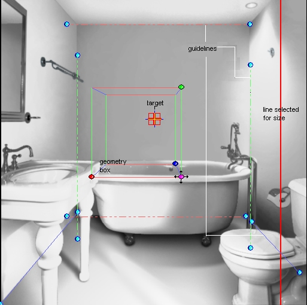

# Setting the Scene Directions{#setting-the-scene-directions}

When the Scene Directions checkbox (under Display in the side menu) is checked, you'll see guidelines representing the three principle scene directions.

There are two guidelines for each direction. Use the green lines to represent the vertical dimension. Use the red and blue lines for the left-right and in-out directions.

In some scenes the choice of left-right versus in-out may be somewhat arbitrary.

** To Set Scene Directions:** 

1. Drag the green lines to align with the vertical directions of the scene.

   Choose two well-defined vertical edges that are as far apart in the photograph as possible, preferably at opposite sides. For example, if wall edges are visible, they may be your best candidates for vertical direction. Edges that are vertical in the real-life scene may not be vertical in the photograph, due to the effect of perspective, but you can still use them.

   Parallel lines (or those that are less than 1 degree off from parallel) appear dotted and do not produce [vanishing points](../../c-vat-3d-mod-pg/c-vat-create-geo/c-vat-persp-van-pts.md#concept-b8d51c1a3fb647eaa61f7a3e0db5085e). You can move parallel lines freely.

   Lines that are not parallel appear solid, and produce a vanishing point. A cross indicates the vanishing point. You might need to zoom out very far to see some vanishing points.

   Hold down the Shift key to change the direction lines and also change the camera model. Move the direction lines without holding down the Shift key to check the alignment of the directions you've set. 

1. Drag the red lines to align with the left-right horizontal directions of the scene.

   Use well-defined edges that are as far apart as possible. For example, you can align the red lines with the top and bottom seams of the back wall, lines on wallpaper, or other horizontal items. Try not to use furniture, since it may be set at an angle. 

1. Drag the blue lines perpendicular to the red lines, to show the in-out (or depth) directions of the scene.

   Set the lines at opposite ends of the photo. For example, you may be able to align the blue lines to the bottoms and tops of the side walls of the scene, or to the grout between floor tiles. 

The effect of perspective may cause lines which are parallel in the scene to converge or diverge in the photograph.

In the next section you'll [set the block](../../c-vat-3d-mod-pg/c-vat-create-geo/t-vat-set-block.md#task-383646d12ec14e84b47d75fad4489175) to finalize the camera model.

To create geometry successfully, complete the following steps, in order:

* [Creating a Camera Model](../../c-vat-3d-mod-pg/c-vat-create-geo/t-vat-cam-mod.md#task-fc39ab753bb248c7a8f86fb27594412e) (setting the scene directions and [Setting the Block](../../c-vat-3d-mod-pg/c-vat-create-geo/t-vat-set-block.md#task-383646d12ec14e84b47d75fad4489175)) 

* [Adding Geometry](../../c-vat-3d-mod-pg/c-vat-create-geo/t-vat-add-geo.md#task-21871477506a4daaa695d638cc159dc0) 
* [Defining Scale for 3D Images](../../c-vat-3d-mod-pg/c-vat-create-geo/t-vat-def-3d-scale.md#task-7938e8b9590543a78d48b678d2d26ba9) 
* [Importing Geometry](../../c-vat-obj-pg/c-vat-abt-obj-pg/t-vat-imp-geo.md#task-a6681c3260ee4a57a177366095981ddc)

>[!MORE_LIKE_THIS]
>
>* [About Geometry](../../c-vat-3d-mod-pg/c-vat-create-geo/c-vat-abt-geo.md#concept-5d07c29f27834afe8e46852c7c71db9c)
>* [About Perspective, Scene Directions, and Vanishing Points](../../c-vat-3d-mod-pg/c-vat-create-geo/c-vat-persp-van-pts.md#concept-b8d51c1a3fb647eaa61f7a3e0db5085e)
