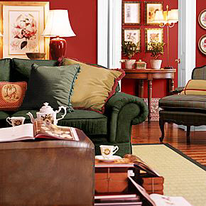
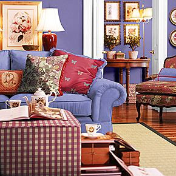
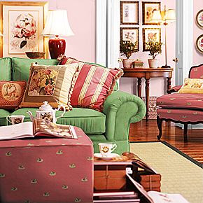
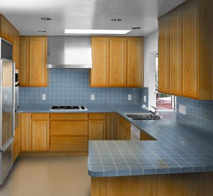
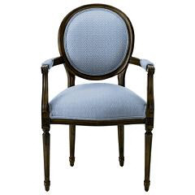

# About Image Authoring{#about-image-authoring}

Use Scene7 Image Authoring to create an image whose surfaces can be varied in unlimited ways.

 You can:

* Create a vignette. 
* Create a set of samples (various ways of coloring or filling the surfaces). 
* Place the image on your Web page.

Users can click the samples to see the surfaces change. They can display many different views of the same image using the samples you provide in a variety of combinations.

For example, a wallpaper manufacturer can display a vignette showing a realistic room setting, along with samples of various wallpapers. When a customer clicks a wall in the vignette, then clicks a wallpaper sample, the wall in the photo displays the wallpaper on the selected wall. The customer can click sample after sample, and the photo changes to display the chosen wallpaper.

Use the same technique to display floor coverings, furniture fabrics, apparel, car interiors-any product that comes in multiple colors, patterns, fabrics, or textures. The resulting renderings match the quality of the original photo.

In the following three samples, the same photo displays different colors and textures on its walls and furniture items.

In a photo that contains flat, shiny surfaces (for example, mirrors, countertops or windows), you can display properties such as reflectance, radiance, and translucency.

You can also create a vignette that features an individual item.

