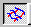

# Changing the Contours of the Flowline Mesh{#changing-the-contours-of-the-flowline-mesh}

You can add vertexes to the outside flowlines so you can bend the Flowline Mesh to match the bends in the object.

You can angle and cross over lines to make the pattern flow more realistic. Keep in mind the natural flow of fabric on the object. Sometimes, fabric folds and part of the pattern disappears inside the fold.

**To Change the Contours of the Flowline Mesh:** 

1. Make sure the [!DNL Mesh] tool  is active.
1. If necessary, adjust the [ [!DNL Flowline] Tension](c_vat_flow_tension_ex.md#concept_BA517724D8E942C6BAC1AB98AE976577).
1. If necessary, [adjust the size of the [!DNL Flowline Mesh]](../../c-vat-flow-pg/c-vat-flow-mesh-tech/c-vat-chg-size-flow-mesh.md#concept-d8011427b214440294a7e6ab38b1988f).
1. Move the pointer over the flowline you want to bend until you see the vertex cursor .
1. Click to break the line and create a vertex. The position of the vertexes establishes the alignment direction for the fabric.
1. [Add vertical and horizontal lines](../../c-vat-flow-pg/c-vat-flow-mesh-tech/t-vat-add-flow-mesh.md#task-091c0660b0d54d1d90dce853541e3117) along the folds and creases of the fabric.
1. Move the pointer over a vertex until you see the drag cursor .
1. Click the vertex and drag it to a new position.

   Drag the vertexes to make the flowlines match the folds and creases in the fabric. Use the arrow keys to move a vertex one pixel at a time.

   To select multiple vertexes, hold down the Shift or Ctrl key as you click them. 

1. If flowlines cross, the overlapping area may look distorted because [!DNL Image Authoring] doesn't know which line is on top. To fix this, [adjust the [!DNL Flowline Depth]](../../c-vat-flow-pg/c-vat-flow-mesh-tech/t-vat-depth-text.md#task-18d316e8b07d4f5a859589ae96f97693).
