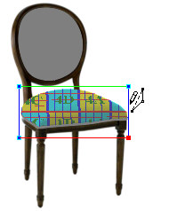
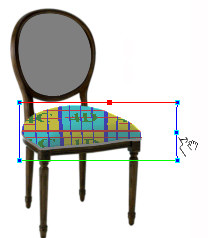

# Changing the Size of the Flowline Mesh{#changing-the-size-of-the-flowline-mesh}

You can make the Flowline Mesh taller or wider.

 ** To Adjust the Size of the Flowline Mesh:**

1. Select the [!DNL Flowline Mesh] tool . 

1. Hold down the Shift key while you drag one of the flowlines.

