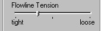
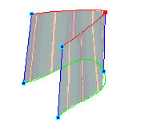
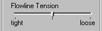
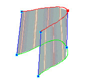
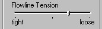
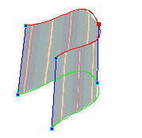
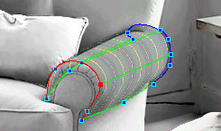

# Creating Curves in Flowlines{#creating-curves-in-flowlines}

If your image contains cylindrical or curved objects, you can use several techniques to curve the Flowline Mesh to match the shape of the object.

You can make some [vertexes](../../../r-vat-glossary/c-vat-vertexes.md#concept-75f0f5b2b22745d18a7245bb0b03e4a1) sharp or curved, and you can adjust the flowline tension.

In the following example, this simple square [!DNL Flowline Mesh] as folded over itself. The loose or tight setting determines the amount of curve in the fold:

 

 

 

When a flowline is tight, it is more angular. When it is loose, it curves more.

