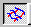

# To Make Vertexes Sharp or Curved{#to-make-vertexes-sharp-or-curved}

1. Make sure the [!DNL Mesh] tool is active .
1. Right-click the vertex to change, and select **[!UICONTROL Make Selected Vertices Sharp]** or **[!UICONTROL Make Selected Vertices Curved]**.
