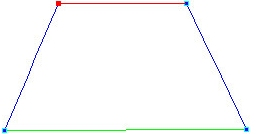
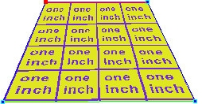
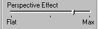
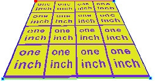

# Adding Perspective Example{#adding-perspective-example}

You can add a perspective effect to a foreshortened image.

For example, the chair seat in the following photograph.

** To Add Perspective to a Foreshortened Image:** 

1. Reshape the [!DNL Flowline Mesh] to display perspective when a texture is applied.

   

1. Apply a preview texture.

   This preview texture is a simple yellow tile that contains the text "one inch":

   

   The closest row of tiles is the same size as the furthest row, indicating a lack of perspective. 

1. Click the **[!UICONTROL Flowline Texture]** tool button .
1. In the side menu, drag the [!DNL Perspective Effect] slider towards the right-hand Max setting.

   

   When perspective is added, the tiles change size to display more realistically:

   

