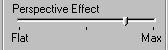

# Adding Perspective{#adding-perspective}

Some vignettes contain surfaces that require perspective.

For example, the foreshortened sleeve in this photo:

You can change the [!DNL Flowline Mesh] to display perspective more effectively.

**To Display Perspective More Effectively:** 

1. Make sure the [!DNL Mesh] tool is active .
1. Drag the [!DNL Flowline Mesh] into the correct shape.
1. Click the **[!UICONTROL Texture]** tool button .
1. In the side menu, drag the [!DNL Perspective Effect] slider towards the right-hand Max setting.

   

   As you drag further to the right, the effect becomes more pronounced. 

