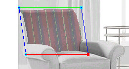
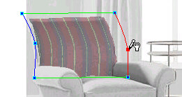

# Adding a Vertex to a Flowline{#adding-a-vertex-to-a-flowline}

After you add a vertex, you can drag it to reshape the Flowline Mesh, or use the arrow keys to move it one pixel at a time.

You can also [change its depth](../../c-vat-flow-pg/c-vat-flow-mesh-tech/t-vat-depth-text.md#task-18d316e8b07d4f5a859589ae96f97693), [make it straight or curved](/help/aem-ia/vignette-authoring-tool/c-vat-work-illum-pg/c-vat-illum-pg-tools/c-vat-histo-curves-opt/t-vat-curves-opt.md), or [delete](../../c-vat-flow-pg/c-vat-flow-mesh-tech/t-vat-interm-vertexes.md#task-629c07f8a541452db16d7fd61bc3b952) it.

**To Use a Vertex to Reshape a Flowline:** 

1. Make sure the [!DNL Mesh] tool is active .
1. Click the flowline where you want the vertex.
1. Move the pointer over a vertex until you see the drag cursor .
1. Click the vertex and drag it to a new position.

   

   

