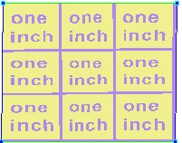
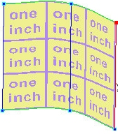
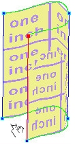
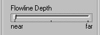
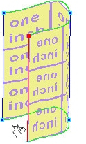
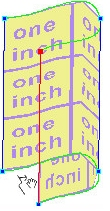

# Overlapping Flowlines Example{#overlapping-flowlines-example}

In the example below, the [!DNL Flowline Mesh] is square and the preview texture is a tile that says "one inch." There are nine repeats of the tile in this mesh:

**To Make This Flat Mesh a Curved Shell:**

1. Drag the right-side flowline toward the middle and continue until it is in front of the left side of mesh:

   

   The texture becomes distorted.

   

1. In the side menu, drag the [!DNL Flowline Depth] slider to the left-side near setting.

   

   This makes the currently selected (red) flowline nearer to you.

   

   Look at the text to get a sense of the adjustment. If this were an enclosure, you would be viewing it from above. You would have to walk into it from the left and read the text along the inside wall. 

1. Drag the near/far slider to the right-side far setting.

   The selected flowline is now farther from you, although you can still see it because the texture is transparent.

   

   Now you would be viewing the enclosure from below. To read the text, you would have to walk along the outside wall.

