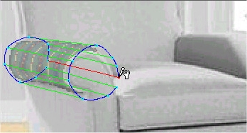

# Overlapping Flowlines{#overlapping-flowlines}

For some objects, you must create a 3-D flowline shell by overlapping sections of the Flowline Mesh.

An example of this can be seen on the arm of this chair:

When you overlap a section, the texture you apply needs to know whether to display the overlapped section in front or behind the rest of the mesh. You must designate each flowline in question as near (in front) or far (in the back).

**To Overlap Flowlines to Create a Shell:** 

1. Make sure the [!DNL Mesh] tool is active .
1. Select the flowline you want to change.
1. In the side menu, drag the [!DNL Flowline Depth] slider to the left or right.
