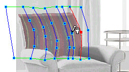

# Reshaping Flowlines{#reshaping-flowlines}

When you change the shape of a flowline, you change the way an applied texture appears on the object.

 ** To Reshape a Flowline:** 

1. Make sure the [!DNL Mesh] tool is active .
1. Click an existing flowline or vertex and drag it. To move it one pixel at a time, use the arrow keys.

