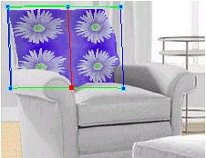
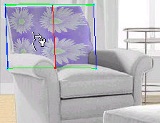

# Stretching Textures Example{#stretching-textures-example}

The texture below displays a single flower:

The texture is applied to the [!DNL Flowline Mesh] on a chair back and is repeated four times. You can stretch some of the instances of the flower.

**To Stretch the Texture on the Chair Back:** 

1. Use the [!DNL Flowline Mesh] tool  to add a new vertical flowline to the center of the mesh:

   

1. Click the **[!UICONTROL Flowline Texture]** tool . Place the pointer over the center flowline, and drag toward the right.

   The texture on the left side is stretched and dragged into the right-hand section:

   

1. Drag toward the left.

   The texture on the right side is stretched and dragged into the left-hand section:

   

