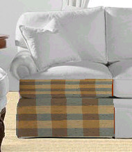
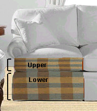

# Matching Up Textures on Adjacent Flowline Objects{#matching-up-textures-on-adjacent-flowline-objects}

You may want textures on adjacent objects to match in size and to align.

For example, so stripes follow along the same path.

The steps below explain how to get the two sections of the couch (which are individual objects, referred to here as Upper and Lower) to match. We have [set the origin](../../c-vat-flow-pg/c-vat-test-flow-work/t-vat-origin-flow-obj.md#task-ad68986712984d8098243e0d0373380b) for the Upper object.

When you match textures across flowline objects, connect large parts before you connect smaller, less relevant ones. Try to connect along the longest edges between parts. Imagine how an upholsterer would position a prominent part of a fabric pattern in the middle of each seat cushion, then flow that fabric up and down the sofa, continuously covering the seat back, and the front of the sofa.

Complete your [!DNL Flowline Mesh] work before you flow textures across objects. In order for this procedure to work, there must be an overlap between the mesh for each adjacent object and the mesh must be roughly the same size (and similarly distributed) on all the objects. If one object's [!DNL Flowline Mesh] is extremely stretched or bunched, the effect is not realistic when you flow the texture across the objects.

**To Match Up Patterns on Adjacent Objects:** 

1. In the [ [!DNL Select Object] box](../../c-vat-gs/c-vat-sel-obj/c-vat-sel-object-box.md#concept-d127c6efaabd436a96c02f36a7bce6ac), select the **[!UICONTROL Lower]** object.
1. Click the **[!UICONTROL Texture]** tool button .
1. Right-click the **[!UICONTROL Flowline Mesh]**, then choose **[!UICONTROL Select as Source Object]**.
1. Select the **[!UICONTROL Flowline]** object that adjusts to the first object you chose.
1. Right-click the area where the two objects overlap and select **[!UICONTROL Match Origin]**, where the name of the actual origin is used in place of [!DNL Origin].
1. Right-click the overlapping area again, then select **[!UICONTROL Match Resolution Along Common Edge]**.

   The Upper object adjusts its origin location relative to the Lower object. The Lower object continues to be the source object until you choose a different source. You can match up other objects to it by repeating steps 4 through 6 for another adjacent object.

   This adjustment is not dynamic. If you change the origin on the Lower object later, the origin of the Upper object does not change again unless you go through these steps again.

   This command may place the origin outside the renderable area of the object, in which case the [dashed cross-hair](../../c-vat-flow-pg/c-vat-test-flow-work/t-vat-origin-flow-obj.md#task-ad68986712984d8098243e0d0373380b) is not visible.

   If you need to make major adjustments to the [!DNL Flowline Mesh] for these objects, you need to go through these procedures again. Minor adjustments should not cause problems.

>[!MORE_LIKE_THIS]
>
>* [About the Origin](../../c-vat-rend-pg/c-vat-work-text/c-vat-abt-origin.md#concept-643d030b62fd42a5bf3ce4e4ab9a3a47)
>* [Changing the Origin for Flowline Objects](../../c-vat-flow-pg/c-vat-test-flow-work/t-vat-origin-flow-obj.md#task-ad68986712984d8098243e0d0373380b)
>* [Matching Up Textures on Adjacent Planes](../../c-vat-obj-pg/c-vat-work-obj/t-vat-text-adj-planes.md#task-20755dfecbfb49e3aa5ccc3b97b3f4d8)
