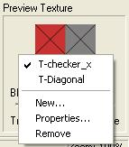

# Choosing a Preview Texture{#choosing-a-preview-texture}

It's important to use an appropriate preview material.

It should make clear to you any potential problem areas. Stripes or plaids are good choices. If the object uses only a particular type of pattern (such as a floral motif), use a pattern close to the one it uses.

You can use any image file as a preview material.

Before you apply a preview material, [set the texture anchor point](../../c-vat-rend-pg/c-vat-work-text/t-vat-text-anchor-pt.md#task-b74408a9bc9641a090d89e8966e4587b) as needed.

**To Change the Preview Material:** 

1. In the side menu, click the **[!UICONTROL Preview Texture]** image and choose a material you've used before or click **[!UICONTROL New]** to choose a different material.

   

1. If you choose new, navigate to the folder that contains the graphic file you want, select the file, then click **[!UICONTROL Open]**.
1. Click **[!UICONTROL OK]**.

   You can remove a preview texture you no longer plan to use by making it the current choice, then choosing **[!UICONTROL Remove]**. Your image uses the next texture in the list until you choose a different one.

   You can change certain characteristics of the texture using the [ [!DNL Texture Material Properties] dialog box](../../c-vat-rend-pg/c-vat-work-text/c-vat-text-mat-prop/c-vat-text-mat-prop.md#concept-56e919cfd48748169dc2f011aa95c5fd).

>[!MORE_LIKE_THIS]
>
>* [Changing Texture Material Properties](../../c-vat-rend-pg/c-vat-work-text/c-vat-text-mat-prop/c-vat-text-mat-prop.md#concept-56e919cfd48748169dc2f011aa95c5fd)
>* [Correcting Color](../../c-vat-troubleshooting/r-vat-corr-color/r-vat-corr-color.md#reference-845cf6537e474053b516422f7666c78f)
