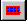

# Changing the Texture Size for Flowline Objects{#changing-the-texture-size-for-flowline-objects}

For flowline objects that display a texture, you can precisely determine the texture size and the number of times the texture repeats on the object.

Size is determined by two settings in the [!DNL Flowline] page:

* The [!DNL Resolution] setting of the graphic file selected in the [!DNL Texture Material Properties] dialog box. 

* The [!DNL Overall Size] setting for the [!DNL Texture] tool.

**To Change the Texture Resolution:** 

1. In the [ [!DNL Select Object] box,](../../c-vat-gs/c-vat-sel-obj/c-vat-sel-object-box.md#concept-d127c6efaabd436a96c02f36a7bce6ac) select the object to which the texture is applied.
1. In the side menu, click the **[!UICONTROL Preview Material]**, then choose **[!UICONTROL Properties]**.
1. On the [!DNL Texture] tab, in the [!DNL Resolution] box, enter the ppi value you used when scanning.

   In the example, you would enter "72" (since this is ppi value used for scanning this sample). 

1. When you are finished, click **[!UICONTROL OK]**.
1. In the side menu, click the **[!UICONTROL Texture]** tool button .
1. Under [!DNL Overall Size], enter the dimensions of the mesh.
