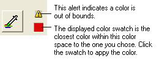

# To Test Color Spaces{#to-test-color-spaces}

1. Click  to go to the [!DNL Render] page.
1. On the [!DNL View] menu, choose **[!UICONTROL Proof Setup]**.
1. Choose the color space to proof, and choose a [!DNL Conversion Intent].

   Choose from the standard ICC options that are listed. The conversion intent tells the color space conversion how to handle colors that are out of bounds for the new color space. 

1. Click **[!UICONTROL OK]**.

   The image is now using the color space you chose. You may want to right-click objects in the image and apply colors at the outer bounds of the color palette to see how they change when you apply the color space.

   When you apply a color that is out of bounds for this color space, the [!DNL Color Picker] displays an alert and shows you the nearest color available in this color space. You can click the displayed color to apply it.

   

1. On the [!DNL View] menu, uncheck [!DNL Proof Colors] and examine the image again.

   Compare the display of the image with and without the new color space to decide which color space to use. 

