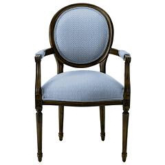

# Preparing an Image in Photoshop{#preparing-an-image-in-photoshop}

For some photos (for example, room scenes), it is helpful to remove color from all decoratable surfaces in the image, especially if the colors are very bright or dark.

This helps reduce edge artifacts (color halos), when rendering with different colors.

You can prepare an image for use as a vignette using some or all of the procedures below. The tools and commands listed are found in Adobe [!DNL Photoshop]. Other professional high-end image editing applications have similar features.

**To Prepare an Image for Use as a Vignette:** 

1. [Crop](../../c-vat-gs/t-vat-crop-vign.md#task-5cc9325e3592489d83109e0cec744bac) and [scale](../../c-vat-prep-img/c-vat-create-opt-img.md#concept-021ab0abc07d4f30be864ab3c3b02eac) the image as needed.
1. If desired, replace the background in the photo with your website background color.

   In the image below, the background has been changed to white.

   

   You can also use the [ [!DNL Texture Eraser] brush](../../c-vat-work-illum-pg/c-vat-illum-pg-tools/t-vat-text-eraser-tool.md#task-fd735e7cd6854f6c98d31057f5119c6a) to remove patterns in an image.
1. Adjust [brightness and contrast](../../c-vat-work-illum-pg/c-vat-illum-pg-tools/t-vat-bright-contr-tool.md#task-3ec7647fb2104ab0923cc9e8782bee6a) as needed.
1. If the image contains strong colors that could cause edge bleed when you change the colors later, you can reduce saturation or completely desaturate these regions.

   You may also have to adjust the brightness and contrast of these regions. 

1. Save the image as 24-bit RGB in PSD, BMP, JPG, PNG, TGA, or TIF format. If you embed an ICC color profile, [!DNL Image Authoring] detects and uses that color profile.
