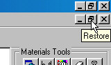
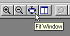
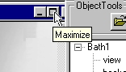

# Resizing Windows{#resizing-windows}

You can change the size of the window displaying the current vignette.

The window detaches from the left-hand pane, so you can move it and see other views. You can return the window to full size without reattaching it to the pane, or you can reattach it.

**To Resize a Window:**

* In the upper right corner, click the **[!UICONTROL Restore]** button for the window.

  

**To View a Resize Window at Full Size:**

* On the toolbar, click the **[!UICONTROL Fit Window]** button.

  

**To Reattach the Window to its Pane:**

* Click the **[!UICONTROL Maximize]** button for the window.

  

