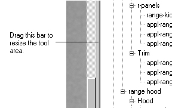

# Changing the Width of the Side Menu Area{#changing-the-width-of-the-side-menu-area}

The side menu area is the right side of the application window, where the tools for each page appear.

You can make this area wider or narrower to accommodate your current editing needs.

**To Resize the Tool Area:**

* Drag the split bar between the tool area and the viewing area.

