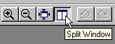

# Splitting Views{#splitting-views}

You can split a window and zoom one side of the split while leaving the other at its original size.

You still have only one window, but you can see two views of it.

**To Create a Split View of the Photo:**

* On the toolbar, click the **[!UICONTROL Split View]** button.

  

**To Revert Back to a Single View:**

* Click the **[!UICONTROL Split View]** button again.

