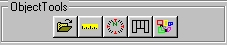
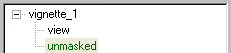

# About the Object Page{#about-the-object-page}

After you create a vignette and create geometry (for 3D vignettes), you begin your work in the Object page.

If you are creating a 2D vignette, you don't need to create geometry.

To go to the [!DNL Object] page, click the **[!UICONTROL Object Page]** button in the toolbar:

The right side of your screen displays the [!DNL Object] tool buttons.

The [!DNL Object Explorer] displays three entries:

* **A Root Entry:** The name of your vignette, or "vignette" if you didn't choose a name. Double-click this entry to see the [ [!DNL Vignette Properties] dialog box](../../c-vat-gs/t-vat-create-vign.md#task-a51b7fb4cce14ea88279116b24cc98b4). 

* **A Sub-Entry:** The name of the view, or "view" if you didn't choose a name. Double-click this entry to see the [ [!DNL View Properties] dialog box](../../c-vat-obj-pg/c-vat-abt-obj-prop/c-vat-view-prop.md#concept-8a396f7b144c46c4806c8ed26619eed1). 

* **A Sub-Entry Unmasked:** The first object listed. Double-click this entry to see the [ [!DNL Object Properties] dialog box](../../c-vat-obj-pg/c-vat-abt-obj-prop/c-vat-unmasked-prop.md#concept-0d60a5d855644db0b773bd3f0b34718b) for the unmasked area of your vignette.

Objects in the [!DNL Object Explorer] are color-coded:

* Blue items accept textures or solid colors. 
* Green items are not renderable. 
* Purple items are not texturable. 
* Red items have an error. For example, these objects may not yet be masked. If an item is red, you can check the [!DNL Warnings] tab in that object's [!DNL Properties] dialog box for an explanation. This tab appears only for objects that have errors.

You'll use the [!DNL Object] page to create an [!DNL Object Explorer] entry for each object in your vignette. You start by [creating the groups](../../c-vat-obj-pg/c-vat-create-grps-obj/t-vat-create-grps.md#task-1c2ae5cfaf3a4c51b153eea44dc3d099) into which your objects are organized. 

>[!MORELIKETHIS]
>
>* [About Objects](../../c-vat-obj-pg/c-vat-abt-obj-pg/c-vat-abt-obj.md#concept-e4110bef9eae44b28c609b4444802753)
>* [Changing an Object's Type](../../c-vat-obj-pg/c-vat-work-obj/t-vat-chg-obj-type.md#task-ce743f3c8ab74682abd1841e340a9e66)
>* [Copying an Object](../../c-vat-obj-pg/c-vat-work-obj/t-vat-copy-obj.md#task-0b0582d7480a4d6991278ecb688c7823)
>* [Deleting a Group or Object](../../c-vat-obj-pg/c-vat-work-obj/t-vat-del-obj.md#task-0b06646b938043acbe4376dff2ceffcc)
>* [Moving an Object](../../c-vat-obj-pg/c-vat-work-obj/c-vat-move-obj.md#concept-adff591e78a04f0d98cfd31cc7f94eed)
