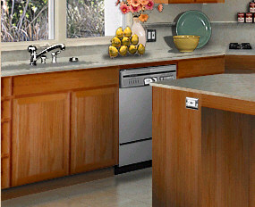
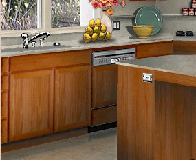
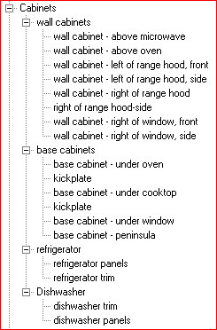

# About Sub-Groups{#about-sub-groups}

A sub-group is a group within a group.

Sub-groups allow objects to be associated with other objects, without necessarily taking on all of their characteristics.

For example, the kitchen vignette below contains a dishwasher. You want a customer to be able to select the dishwasher and apply a color...

... or a cabinet front that matches the surrounding cabinets:

If the dishwasher is in a separate sub-group, the customer can choose whether the dishwasher receives a color or adapts the finish of the surrounding cabinets.

In the illustration below, the group Cabinets contains four sub-groups: wall cabinets, base cabinets, refrigerator, and dishwasher.

>[!MORELIKETHIS]
>
>* [About Objects](../../c-vat-obj-pg/c-vat-abt-obj-pg/c-vat-abt-obj.md#concept-e4110bef9eae44b28c609b4444802753)
>* [Creating and Editing Groups](../../c-vat-obj-pg/c-vat-create-grps-obj/t-vat-create-grps.md#task-1c2ae5cfaf3a4c51b153eea44dc3d099)
