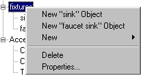

# Creating 2D Objects{#creating-d-objects}

When you create a new object you decide which type of surface it will have.

You [create the surface later](../../c-vat-work-mask-pg/c-vat-create-mask/t-vat-add-mask.md#task-f8d4ae100d834ace9f90f7f260bf15aa), using the [!DNL Mask] page.

If you plan to render some objects with simple, smooth textures only, such as heathered fabrics, see [Rendering Heathering and Simple Texture Effects](../../c-vat-rend-pg/c-vat-rend-obj/t-vat-heather-text-eff.md#task-00de2da0ac644349868db8249dd2ab2c) before you create your objects.

**To Create a New Object:** 

1. In the [ [!DNL Object Explorer]](../../r-vat-glossary/c-vat-obj-explorer.md#concept-da56038ea82c40a1a10576f99f2f6836), right-click the name of the group that contains the object.
1. Select the object type for the new object.

    * **New Non-Texturable Object:** For objects that accept color, but no texture. Use this option if you use this vignette on your [!DNL Image Rendering] server but will not apply textures to it, as these object types render faster. [!DNL Non-Texturable Objects] do not render decals. 
    
    * **New Flat Object:** For objects that do not fold or crease (unlike fabrics) and that accept color or texture. 
    * ** New Flowline Object:** For fabric objects that use a patterned material. You can create flowlines for a [!DNL Flowline] object. 
    
    * **New Sketch Object:** For fabric objects that use a patterned material. You can create sketch features for a [!DNL Sketch] object.

      Generally, you use flowlines for three-dimensional objects like upholstered furniture. You use sketch features for apparel and linens. Edit [!DNL Flowline] objects on the [!DNL Flowline] page tool and [!DNL Sketch] objects on the [!DNL Sketch] page. 
    
    * **New Wall, Cabinet, Appliance, and Door Object:** For walls, cabinets, appliances or doors.

      If you attached a template to this vignette, your choices include the objects that were saved with that template. For example, when you right-click, the list might look like this:

      

1. For [!DNL Name], type a unique name for the object.

   Every object and group must use a unique name. If you created an object from the template, a default name appears. 

1. If appropriate, check [!DNL No Texture] for objects that accept color but no textures.
1. Click **[!UICONTROL OK]**.
If you need to change the object properties you just set, right-click the object in the [ [!DNL Object Explorer]](../../r-vat-glossary/c-vat-obj-explorer.md#concept-da56038ea82c40a1a10576f99f2f6836) and choose **[!UICONTROL Properties]**.

Once you have created your hierarchy of groups and objects, use the [!DNL Mask] page to [define the object surfaces](../../c-vat-work-mask-pg/c-vat-create-mask/t-vat-add-mask.md#task-f8d4ae100d834ace9f90f7f260bf15aa). 

>[!MORE_LIKE_THIS]
>
>* [About Objects](../../c-vat-obj-pg/c-vat-abt-obj-pg/c-vat-abt-obj.md#concept-e4110bef9eae44b28c609b4444802753)
>* [Changing an Object's Type](../../c-vat-obj-pg/c-vat-work-obj/t-vat-chg-obj-type.md#task-ce743f3c8ab74682abd1841e340a9e66)
>* [Copying an Object](../../c-vat-obj-pg/c-vat-work-obj/t-vat-copy-obj.md#task-0b0582d7480a4d6991278ecb688c7823)
>* [Creating 3D Objects](../../c-vat-obj-pg/c-vat-create-grps-obj/t-vat-create-3d-obj.md#task-adac1e1e26024993aa97ed6c7e87c084)
>* [Creating and Editing Groups](../../c-vat-obj-pg/c-vat-create-grps-obj/t-vat-create-grps.md#task-1c2ae5cfaf3a4c51b153eea44dc3d099)
>* [Deleting a Group or Object](../../c-vat-obj-pg/c-vat-work-obj/t-vat-del-obj.md#task-0b06646b938043acbe4376dff2ceffcc)
>* [Moving an Object](../../c-vat-obj-pg/c-vat-work-obj/c-vat-move-obj.md#concept-adff591e78a04f0d98cfd31cc7f94eed)
