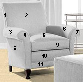
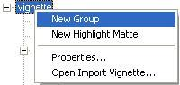

# Creating and Editing Groups{#creating-and-editing-groups}

A vignette can contain several items.

For example, a photo of a room may contain images of several chairs. A single item in a photo image can contain several [objects](../../r-vat-glossary/c-vat-object.md#concept-98ef4893a0954578a993178d98aaffeb). You can create a hierarchy for your vignette. Organize the groups in the hierarchy according to how material is applied to them.

For example, the chair in the illustration below might be a group within a larger image. The numbers indicate the different objects in the chair. When a customer views the vignette and clicks any part of the chair, the whole chair is decorated with the selected sample because all of the objects in the chair are in the same group. Dividing the group into objects lets you apply the sample differently to each object, so the rendering looks realistic. You can also create [sub-groups](../../c-vat-obj-pg/c-vat-create-grps-obj/c-vat-abt-sub-grps.md#concept-bb725e89c8104e6ca2501ffadde6bfb2).

If you plan to render some objects with simple, smooth textures only, such as heathered fabrics, see [Rendering Heathering and Simple Texture Effects](../../c-vat-rend-pg/c-vat-rend-obj/t-vat-heather-text-eff.md#task-00de2da0ac644349868db8249dd2ab2c) before you create your objects.

**To Create a Group:** 

1. In the [ [!DNL Object Explorer]](../../r-vat-glossary/c-vat-obj-explorer.md#concept-da56038ea82c40a1a10576f99f2f6836), right-click the vignette name and select **[!UICONTROL New Group]**.

   

1. For [!DNL Name], type a name for the group.

   If you created a group from the template, a default name appears. 

1. If your vignette includes menus that let the user change edit options for the group options, enter the proper attributes here.
1. Click **[!UICONTROL OK]**.
1. If you ever need to change the group properties you just set, right click the group in the [ [!DNL Object Explorer]](../../r-vat-glossary/c-vat-obj-explorer.md#concept-da56038ea82c40a1a10576f99f2f6836) and choose **[!UICONTROL Properties]**.

>[!MORE_LIKE_THIS]
>
>* [About Sub-Groups](../../c-vat-obj-pg/c-vat-create-grps-obj/c-vat-abt-sub-grps.md#concept-bb725e89c8104e6ca2501ffadde6bfb2)
>* [Creating 3D Objects](../../c-vat-obj-pg/c-vat-create-grps-obj/t-vat-create-3d-obj.md#task-adac1e1e26024993aa97ed6c7e87c084)
>* [Creating 2D Objects](../../c-vat-obj-pg/c-vat-create-grps-obj/t-vat-create-2d-obj.md#task-b0c168d6f127408c882e8f1de36c8bc7)
