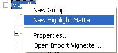

# Creating a Highlight Matte Object{#creating-a-highlight-matte-object}

For items that use a glossy material, such as a metallic finish or patent leather, you can create a Highlight Matte object that lets you specify high reflectivity for specific areas of that object.

This feature is intended for vignettes that display a single product shot, rather than a room scene. For example, if your vignette shows a purse that is available in a metallic-finish vinyl and patent leather, you could use a [!DNL Highlight Matte] object to display a bright area where the light reflects off the object, with an even brighter highlight within that bright area.

The [!DNL Highlight Matte] object covers the entire vignette, and lets you specify multiple areas of reflection. However, you can create more than one [!DNL Highlight Matte] object if you want to layer areas of reflection.

**To Add a Highlight Matte Object to the Vignette:** 

1. Right-click the vignette name and choose **[!UICONTROL New Highlight Matte]**.

   

1. On the [!DNL Mask] page, [specify two layers of highlights](../../c-vat-work-mask-pg/c-vat-create-mask/t-vat-high-matte-obj.md#task-a999ee1887384d16ba39dc763ed0c774): one layer that has approximately 50% opacity and one layer that has 100% opacity.
1. On the [!DNL Illumination] page, use the [ [!DNL Highlight] tool](../../c-vat-work-illum-pg/c-vat-illum-pg-tools/t-vat-high-tool.md#task-3983e62a172640a6b97270913b356102) to adjust the highlights and base illumination until the desired effect is achieved.
