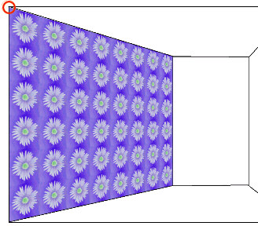
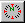
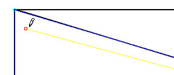
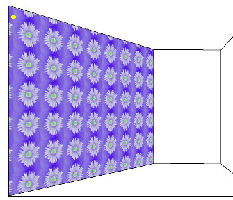

# The Alignment Tool{#the-alignment-tool}

Use the Alignment tool to change the origin (the point at which the upper left corner of the first full texture tile appears on an object) and the texture direction.

The origin on the object works in conjunction with the texture anchor point for the applied texture. You can adjust the texture anchor point for the texture using the [!DNL Texture] tab of the [ [!DNL Texture Material Properties] dialog box](../../c-vat-rend-pg/c-vat-work-text/c-vat-text-mat-prop/c-vat-text-mat-prop.md#concept-56e919cfd48748169dc2f011aa95c5fd), which is available on the [!DNL Flowline], [!DNL Sketch], and [!DNL Render] pages.

Changing the origin is useful if you apply a border to the top of the wall and you want the wallpaper to begin at the bottom edge of the border. For example, you might want to apply this texture to a wall:

The starting point of the first texture tile coincides with the upper left corner of the wall. In the picture below, the first tile is indicated in red:

## To Change the Origin with the Alignment Tool: {#section-a50902dc4dbc494ba6335db7b1a8906a}

1. On the [!DNL Object] page, click the **[!UICONTROL Alignment]** tool . 

1. To move the origin down a little, click a new point in the wall:

When you render the wall, the first full texture tile starts at the point you clicked (the yellow dot in the picture below), and the wall looks like this:

You can also rotate the origin by selecting the planar object to rotate, selecting the [!DNL Alignment] tool, right-clicking, and choosing a rotation option.

The origin choices on the context menu for the [!DNL Alignment] tool are determined by the [origins] section of the [!DNL vat.ini]file. You can have a total of six user defined origins, but origin 2 is reserved by [!DNL Image Authoring]. The entry in the first position in the [!DNL vat.ini] file is the default choice in the drop-down list. Choose an origin from the list and define it by positioning the origin manually on the selected object.

## To Change the Direction of a Texture with the Alignment Tool: {#section-f3c6bb1b947a427abe29ae08bfc0f880}

1. Click the **[!UICONTROL Object Page]** button . 

1. Select the object whose texture you want to change. 
1. Click the **[!UICONTROL Alignment]** tool . 

1. Ctrl-click the object.

You can also right-click the object and choose a **[!UICONTROL Rotate]** command.  
>[!MORE_LIKE_THIS]
>
>* [About the Origin](../../c-vat-rend-pg/c-vat-work-text/c-vat-abt-origin.md#concept-643d030b62fd42a5bf3ce4e4ab9a3a47)
>* [Changing the Texture Anchor Point](../../c-vat-rend-pg/c-vat-work-text/t-vat-text-anchor-pt.md#task-b74408a9bc9641a090d89e8966e4587b)
