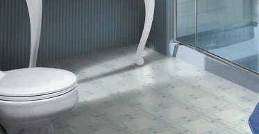

# Setting the Perspective for a Flat Object with the Model Tool{#setting-the-perspective-for-a-flat-object-with-the-model-tool}

 The [!DNL Edit Model] tool is useful when your photo contains objects in perspective, such as the floor in this photo.

