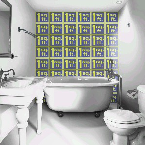

# Sizing Wallpaper{#sizing-wallpaper}

In the image below, the tiles of the wallpaper are one foot square. The wall is 72 inches by 96 inches.

* 6 tiles across (1 tile = 12 in. wide, 12 x 6 = 72) 
* 8 tiles down (1 tile = 12 in. high, 12 x 8 = 96)

