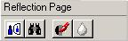

# About the Reflection Page{#about-the-reflection-page}

After you mask the objects in your vignette, you use the Reflection page to determine how objects in a 3D vignette are reflected by their surrounding objects.

If your vignette contains only [two-dimensional objects](../../c-vat-obj-pg/c-vat-create-grps-obj/t-vat-create-2d-obj.md#task-b0c168d6f127408c882e8f1de36c8bc7), you cannot create reflections. Instead, go on to [rendering](../../c-vat-rend-pg/c-vat-abt-rend-pg/c-vat-abt-rend-pg.md#concept-0a56eec3cafe45658d25c0988d818fc0).

To go to the [!DNL Reflection] page, click the **[!UICONTROL Reflection Page]**button in the toolbar:

The right side of your screen displays the [!DNL Reflection] tool buttons.

