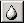

# The Blur Brush{#the-blur-brush}

After you have generated the Reflection Map and corrected the Alpha for your reflections, use this tool to blur the reflection effect in a particular area of the image.

 **To Blur the Alpha Intensity for an Objector Group:** 
1. Select an object or a group.

   Select an object or group from the [ [!DNL Select Object] box](../../../c-vat-gs/c-vat-sel-obj/c-vat-sel-object-box.md#concept-d127c6efaabd436a96c02f36a7bce6ac), or hold down the Alt key and click. If you use the Alt key method, check the [!DNL Select Object]box to see what's selected. 

1. Set the [!DNL Image] to [!DNL Alpha].
1. Click the **[!UICONTROL Blur Brush]** .
1. Use the tool to blur areas of the [!DNL Alpha Map] for the selected object or group.
**You Can Set the Following Options for the Blur Brush:**

* **Blur Effect:** The higher the percentage, the more pronounced the effect. 
* **Filter Size:** Changes the nature of the brush stroke, but the differences are subtle. 
* **Apply to Whole Object:** Applies your changes to the entire object or group that is currently selected. 
* **Brush Size:** Determines the size for the brush. 
* **Brush Edge:** Determines the sharpness for the brush.

