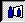

# Creating the Reflection Map{#creating-the-reflection-map}

You create a Reflection Map to add reflection information to the image, much the way you create an Illumination Map to add shadow and highlight information.

A [!DNL Reflection Map] is necessary only if you are creating a [three-dimensional vignette](../c-vat-3d-mod-pg/c-vat-abt-3d-mod-pg/c-vat-abt-3d-mod-pg.md#concept-93553c563c534d839a5cf0f2aafa70ee). Generate the [!DNL Reflection Map] after you've completed all the vignette steps except rendering. If you render your image after creating a [!DNL Reflection Map], the rendering shows you the reflections.

**To Create a Reflection Map:** 

1. [Create](../c-vat-3d-mod-pg/c-vat-create-geo/c-vat-abt-geo.md#concept-5d07c29f27834afe8e46852c7c71db9c) and [import](../c-vat-obj-pg/c-vat-abt-obj-pg/t-vat-imp-geo.md#task-a6681c3260ee4a57a177366095981ddc) the [!DNL 3D Modeling] geometry.
1. Create any [flowline extrusions](../c-vat-obj-pg/c-vat-create-grps-obj/t-vat-create-3d-obj.md#task-adac1e1e26024993aa97ed6c7e87c084) you need and [attach objects to planes](../c-vat-obj-pg/c-vat-abt-obj-pg/t-vat-assign-obj.md#task-e8ad247824b24fb0b05e115df24c45b6).
1. Click the **[!UICONTROL Reflection Page]** button .
1. On the [!DNL Reflection] page, click the [!DNL Reflection Map] tool .
1. In the side menu, click **[!UICONTROL Generate Reflection Map for Full Image]**.

   A progress bar displays while the [!DNL Reflection Map] is updating. You can click **[!UICONTROL Cancel]** (in the lower left-hand corner of the window) to stop the process. 

1. Check the results of your work by choosing the [!DNL Reflection] option for [!DNL Image].

   Look at the floors and countertops to see if reflections are aligned well and that the proper objects are reflected. 

1. Click the [ **[!UICONTROL Alpha]** tool](../c-vat-refl-pg/c-vat-use-refl-tools/t-vat-alpha-tool.md#task-35aa13f7a88741cf93621fe76efb8fa3) , then click the **[!UICONTROL Correct Alpha]** button.
1. Check the results of your work by choosing the **[!UICONTROL Alpha]** option for [!DNL Display].

   The [!DNL Alpha Map] shows bright and dark areas of the [!DNL Reflection Map]. You can [adjust the [!DNL Alpha Map]](../c-vat-refl-pg/c-vat-use-refl-tools/t-vat-alpha-tool.md#task-35aa13f7a88741cf93621fe76efb8fa3), if you like. 

1. [Render materials](../c-vat-rend-pg/c-vat-abt-rend-pg/c-vat-abt-rend-pg.md#concept-0a56eec3cafe45658d25c0988d818fc0) to see the final results.

   You may need to adjust the 3D geometry or the [!DNL Reflection Map]to get the final results you want. 

If you change [masking](../c-vat-work-mask-pg/c-vat-create-mask/t-vat-add-mask.md#task-f8d4ae100d834ace9f90f7f260bf15aa), [planar associations](../c-vat-obj-pg/c-vat-abt-obj-pg/t-vat-assign-obj.md#task-e8ad247824b24fb0b05e115df24c45b6), or [3D object types](../c-vat-obj-pg/c-vat-work-obj/t-vat-chg-obj-type.md#task-ce743f3c8ab74682abd1841e340a9e66), you have to regenerate the [!DNL Reflection Map]. 
