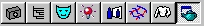

# About the Render Page{#about-the-render-page}

After you mask the objects in your vignette, you use the Render page to determine how a texture or solid color looks on an object.

 To go to the [!DNL Render] page, click the **[!UICONTROL Render Page]** button in the toolbar:

The right side of your screen displays the [!DNL Render] tool buttons.

You can render objects with solid colors or with textures.

* Non-Texturable Objects accept only solid colors. 
* [!DNL Flowline] objects, such as apparel, upholstery, and bedding, can accept [textures](../../r-vat-glossary/c-vat-textures.md#concept-987474ad74614183bb67931e2789978f) or colors. 

* Flat objects, such as floors, ceilings, countertops, and doors, can accept textures or colors. 
* [Decals](../../c-vat-rend-pg/c-vat-rend-obj/c-vat-decals/t-vat-app-decal.md#task-16ff67be05f84b06b4c0caf73ff01f83) can accept textures and colors. 
* Walls can accept textures or colors. You can apply these treatments to [different parts of walls](../../c-vat-rend-pg/c-vat-rend-obj/t-vat-wall-sub-opt.md#task-cd94251ff76749268ca39caf5b97c072), and you can apply borders if you've defined them with the [ [!DNL Layout] tool](../../c-vat-obj-pg/c-vat-obj-pg-tools/c-vat-layout-tool/c-vat-layout-tool.md#concept-0d40267507b0410693d69168797fa5bd). 

* Cabinets can accept [cabinet styles](../../c-vat-rend-pg/c-vat-rend-obj/t-vat-cab-opt.md#task-643510921338421ba329ecd4134ac252) (files with a [!DNL .VNC] extension), regular textures, and solid colors.

Cabinets in the [!DNL Illumination Map] must be texture-free in order to render correctly.

* Window coverings can accept [window-covering styles](../../c-vat-rend-pg/c-vat-rend-obj/c-vat-window-cov/t-vat-use-window-cov.md#task-57ae1754b3c84c9eabc3f52bf702fe7a) (files with a [!DNL .VNW] extension). 

* Appliances can accept textures or colors.

In a kitchen vignette, you may want appliances that can accept a color or the cabinet finish of the surrounding cabinets. To achieve this, you must create objects in [sub-groups](../../c-vat-obj-pg/c-vat-create-grps-obj/c-vat-abt-sub-grps.md#concept-bb725e89c8104e6ca2501ffadde6bfb2).

If you are [creating a 3D vignette](../../c-vat-3d-mod-pg/c-vat-abt-3d-mod-pg/c-vat-abt-3d-mod-pg.md#concept-93553c563c534d839a5cf0f2aafa70ee), [create the [!DNL Reflection Map]](../../c-vat-refl-pg/t-vat-create-refl-map.md#task-d9fd1e5c60df440098920cc955b279c6) before rendering. If you render your image after creating a [!DNL Reflection Map], the rendering shows you the reflections. 
