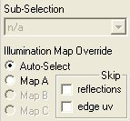

# Render Page Options{#render-page-options}

The options at the bottom of the side window are always available.

**Sub-Selection:** For wall objects. Lets you select previously defined areas of the wall. You create wall areas by defining [border lines using the [!DNL Layout] tool](../../c-vat-obj-pg/c-vat-obj-pg-tools/c-vat-layout-tool/c-vat-layout-tool.md#concept-0d40267507b0410693d69168797fa5bd).

**Illumination Map:** Determines the [!DNL Illumination Map] used for this vignette. Map A is automatically generated when you begin working on the [!DNL Illumination] page, after you have masked your objects. You can edit the [!DNL Illumination Map] with a third-party graphics tool such as [!DNL Photoshop].

Multiple [!DNL Illumination Maps] can be used in room scenes, where, for example, a refrigerator may have a shiny metallic finish in addition to the flatter color finishes used for other surfaces. Most vignettes use only Map A.

**Skip Reflections:** Check this box to speed up the rendering of 3D vignettes by ignoring any [!DNL Reflection Map] you generated on the [!DNL Reflection] page. You may want to do this as you experiment with various materials, then uncheck this option for final rendering.

**Skip Edge uv:** Check this box to speed up the rendering of vignettes by disabling the generation of the data required for anti-aliasing of edges within flowlines (along folds or overlaps). If you haven't changed the flowlines for the current vignette, edge uv maps are not generated in any case. 
