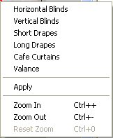

# Using a Window Covering{#using-a-window-covering}

In Image Authoring, you can use a window-covering image you authored with the Content Authoring tool in any vignette.

 **To Use the Window-covering Image:** 

1. In [!DNL Image Authoring], create or open a 3D vignette in which you want to use the window covering.
1. [Create the geometry](../../../c-vat-3d-mod-pg/c-vat-create-geo/c-vat-abt-geo.md#concept-5d07c29f27834afe8e46852c7c71db9c) for your vignette and [define its planes](../../../c-vat-3d-mod-pg/c-vat-create-geo/t-vat-add-geo.md#task-21871477506a4daaa695d638cc159dc0).
1. On the [!DNL Object] page, [create a new group](../../../c-vat-obj-pg/c-vat-create-grps-obj/t-vat-create-grps.md#task-1c2ae5cfaf3a4c51b153eea44dc3d099), then [add a Window Covering Frame](../../../c-vat-obj-pg/c-vat-create-grps-obj/t-vat-create-3d-obj.md#task-adac1e1e26024993aa97ed6c7e87c084).
1. Align the window covering frame with a plane:

    * Click the [ [!DNL 3D Import] tool](../../../c-vat-obj-pg/c-vat-abt-obj-pg/t-vat-imp-geo.md#task-a6681c3260ee4a57a177366095981ddc) to see the planes defined for this vignette. 
    * Select the Window Covering Frame. 
    * Click the plane that the window-covering is aligned with (for example, the wall on which the window is located). 
    * Right-click and choose **[!UICONTROL Set Plane]**.

1. Make sure the window covering displays on top of other objects, like window hardware:

    * Double-click the window-covering in the [!DNL Object Hierarchy]. 
    * On the [!DNL General] tab of the [!DNL Properties] dialog box, set the z-order for the window covering. It should be a number higher than 1. The z-order value determines where the window covering appears in a stack of objects. The higher the z-order value, the higher the object is in the stack (the closer it is to the viewer). No two overlap objects within a single vignette should use the same z-order value.

1. Define the area that the window covering will fill:

    * Click the **[!UICONTROL Layout]** tool. 
    * Ctrl-right-click the window-covering and choose a type.

      

    * Drag to form the outline of the window-covering area. This is the area that the [!DNL .vnw] image will fill.

      For example, if the window covering is a valance, draw the outline at the top of the window. If it is a drape, draw the outline along the sides and below the window.

      The frame in the [!DNL .vnw] file aligns with the window-covering frame in the vignette. If the frame in the [!DNL .vnw] file is smaller than the window-covering frame, the window covering extends beyond the frame in the vignette. For drapes, the top edge of the frames should be positioned to correspond to where the drape connects to the top edge of the drapery rod.

      Depending on the type of window covering, it is stretched vertically, horizontally, or in both directions to match the frame. For example, a valance is stretched horizontally to match the width of the frame, scaled vertically based on the resolution, and positioned so that the top edge of the frame in the [!DNL .vnw] file aligns with the top edge of the frame in the vignette. Three of the four frame edges align, the bottom edge is not matched. 
    
    * Drag the red box representing the anchor point to the position where you want the drop shadow to originate. 
    * Right-click and choose **[!UICONTROL Apply]**.

1. On the [!DNL Render] page, apply the window covering you created in the [!DNL Content Authoring] tool:

    * Select the window-covering frame. 
    * Click the **[!UICONTROL Apply New Materials]** tool  and choose **[!UICONTROL Apply Window Covering]**. 
    
    * Select the [!DNL .vnw] file you created with the [!DNL Content Authoring] tool.

1. You can do any of the following:

    * Use the [ [!DNL Window Covering Frame Properties]](../../../c-vat-rend-pg/c-vat-rend-obj/c-vat-window-cov/t-vat-window-cov-prop.md#task-a7ebddaeaeb94215af7912b92b2b6126) dialog box to change aspects of the window-covering frame, such as the shadow cast by the window covering. 
    * Use the [ [!DNL Window Covering Material Properties]](../../../c-vat-rend-pg/c-vat-rend-obj/c-vat-window-cov/t-vat-window-cov-mat-prop.md#task-9e1b623d77b0436299984408d9787805) dialog box to change aspects of the window-covering texture, such as the opacity of the window covering.

