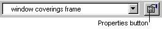

# Changing Window Covering Frame Properties{#changing-window-covering-frame-properties}

You can change information about the window covering frame.

 **To Change the Properties for a Window Covering Frame:** 

1. Select the window covering frame, then click the **[!UICONTROL Properties]** button next to the [!DNL Selected Object] field.

   

1. In the [!DNL Object Properties] dialog box, click the **[!UICONTROL General]** tab to change information about the window covering frame.

   ** Name:** The name you provided for the object when you created it. You can change this at any time.

   **Z-Order:** Specifies whether this object renders above or below other items, for example, window hardware. Window coverings should always have a z-order value higher than 1. 

1. Click the [ **[!UICONTROL Warnings]** tab](../../../c-vat-obj-pg/c-vat-abt-obj-prop/c-vat-app-obj-prop/c-vat-warning-tab.md#concept-a4134befdef446a9bb4f5fbb3f9b27d1) to see any problems with this object.
1. Click the [ **[!UICONTROL Plane]** tab](../../../c-vat-obj-pg/c-vat-abt-obj-prop/c-vat-app-obj-prop/c-vat-plane-tab-3d-obj.md#concept-e0addb7f0f8f48678bf3b09bbf74f67c) to change the properties of the [3D plane attached to this object](../../../c-vat-obj-pg/c-vat-abt-obj-pg/t-vat-assign-obj.md#task-e8ad247824b24fb0b05e115df24c45b6), as generated on the [ [!DNL 3D Modeling] page](../../../c-vat-3d-mod-pg/c-vat-abt-3d-mod-pg/c-vat-abt-3d-mod-pg.md#concept-93553c563c534d839a5cf0f2aafa70ee).
1. Click the **[!UICONTROL Quad]** tab to change the bounding box for this object.
1. Click the **[!UICONTROL Texture]** tab to change the [!DNL Decal Attach] settings, such as the light vector angle which controls the angle of the shadow cast by the window covering.
