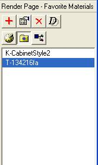

# The Favorite Materials Tool{#the-favorite-materials-tool}

Use the Favorite Materials tool to save materials you want to re-use.

If you have saved a set of color swatches to a [!DNL Photoshop] [!DNL .aco] file, you can import that file to add all the colors in it to a Favorites folder. You can import grayscale, RGB, CMYK, and CIELab colors. To import CIELab colors, you must [enable color management](../../../c-vat-gs/c-vat-abt-color-mgmt/c-vat-abt-color-mgmt.md#concept-2a2d355fd8e841ca95a926397aed4cab). If you want the CMYK swatches you import to use the same RGB values in [!DNL Image Authoring] as they do in [!DNL Photoshop], you must [enable color management](../../../c-vat-gs/c-vat-abt-color-mgmt/c-vat-abt-color-mgmt.md#concept-2a2d355fd8e841ca95a926397aed4cab) and the [CMYK import profile](../../../c-vat-img-auth-opt/t-vat-color-pref.md#task-b73fd4722e9247e8bce1f5a70518c33d) must match [!DNL Photoshop's] CMYK working profile.

You can auto-populate a [batch-render list](../../../c-vat-rend-pg/c-vat-rend-obj/t-vat-batch-rend.md#task-5d1986172ea0426892163cfa54a142a7) from the [!DNL Favorite Materials] list by saving the materials with the object. You can save individual materials or a folder of materials.

You can share the items in your [!DNL Favorite Materials] list with other users.

Make sure you consider the following when you create a [!DNL Favorite Materials] list to share:

* When another user copies your [!DNL Favorite Materials] list, your list replaces the user's previous [!DNL Favorites] list, as well as the [!DNL Material History] list and the [!DNL Preview Textures] used for the [!DNL Flowline] and [!DNL Sketch] pages. If this is not desirable, copy the texture files only to a location accessible by other users. Those users can then apply the textures and save them to their own [!DNL Favorite Materials] lists. 

* In order to be sure that the path names of the texture files in your [!DNL Favorite Materials] list are accurate for other users, start by copying the texture files to a shared location (before you add them to your [!DNL Favorite Materials] list).

