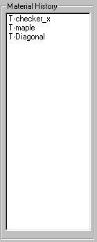

# The Material History Tool{#the-material-history-tool}

Use the Material History tool to see a list of all textures you have applied recently.

Solid colors are not listed. You can specify [how many items can appear in this list](../../c-vat-rend-pg/c-vat-abt-rend-pg/c-vat-rend-pg-pref.md#concept-158b19aeeda74bb28fcac3b684ca1efc).

** To Apply a Texture From the Material History List:** 

1. Select the object or group to which you want to apply the texture.
1. Click the **[!UICONTROL Material History]** tool .
1. Double-click the texture you want in the [!DNL Material History] list.
