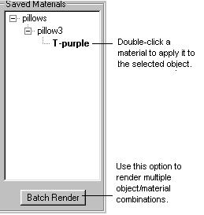

# The Saved Materials Tool{#the-saved-materials-tool}

Use the Saved Materials tool to save textures and solid colors you want to associate with objects or groups in your vignette and use for batch rendering.

 

If you have a set of custom colors or texture files that you use frequently, you can save them on the [!DNL Saved Materials] list. You can then apply those materials to other objects or groups in your vignette. You can also set up the [!DNL Saved Materials] list to use with [ [!DNL Batch Rendering]](../../../c-vat-rend-pg/c-vat-rend-obj/t-vat-batch-rend.md#task-5d1986172ea0426892163cfa54a142a7). 
The [!DNL Saved Materials] list remembers which object or group used which color or texture, and it saves the colors and textures in a hierarchy (like the [ [!DNL Object Explorer]](../../../r-vat-glossary/c-vat-obj-explorer.md#concept-da56038ea82c40a1a10576f99f2f6836)). 