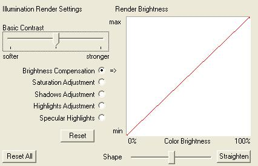

# Shader {#shader}

This tab appears only if you checked Use Alternative Shader on the Illumination tab of the View Properties dialog box.

If this tab appears, the [!DNL Render] tab does not.

The [!DNL Shader] tab lets you fine-tune the contrast for a particular material or color on a particular object without changing the [Illumination Map](../../../c-vat-work-illum-pg/c-vat-abt-illum-pg/c-vat-illum-maps.md#concept-3243a49c92dd4491947481d339d12f3f). This is helpful if some of the materials you are rendering are very bright or very dark and need special illumination considerations that don't affect the image as a whole. It is most useful for apparel and upholstery.

**Illumination Render Settings:** You can change the brightness and darkness for your rendered image. The settings are cumulative. It is best to work while viewing the material in question under the same lighting as the image uses.

* **Basic Contrast:** Adjusts the contrast for the entire selected area. Start by adjusting this slider. If it does not produce the desired results, adjust the remaining controls.

  Click the item to adjust, then adjust the incoming brightness of the image to the rendered brightness (similar to the [!DNL Curve] option on the [Histogram tool](/help/aem-ia/vignette-authoring-tool/c-vat-work-illum-pg/c-vat-illum-pg-tools/c-vat-histo-curves-opt/c-vat-histo-curves-opt.md)). A steeper curve increases contrast.

  Use the [!DNL Shape] slider to create a curve. You can make the resulting curve into straight lines instead by clicking [!DNL Straighten].

  You can also drag the available handles in the [!DNL Render] area on the right. The number and position of available handles varies.

  To return a single setting to its original curve, select it and click **[!UICONTROL Reset]**. To return all settings to their original curves, click **[!UICONTROL Reset All]**.

**Brightness Compensation:** Reduces luminosity for the entire texture or color. This can be useful for very bright or light colors.

**Saturation Adjustment:** Adjusts the HSI balance of the texture or color.

**Shadows Adjustment:** Adjusts contrast for dark areas.

**Highlights Adjustment:** Adjusts contrast for bright areas.

**Specular Highlights:** Adjusts contrast for shiny areas (determined by the [!DNL Illumination Map]). This places white highlights on top of other settings, and is independent of those settings. 
