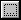

# Texture{#texture}

 **File/URL:** Choose a texture file. You may have to click  and navigate to the folder that contains the file you want. Make sure the texture file displays a [full-tile repeat](../../../c-vat-troubleshooting/r-vat-full-tile-repeat/r-vat-full-tile-repeat.md#reference-7dc916534a864b2d9a5d21ca31056b54). Initially, this field displays the current known location for the texture file. To change that location, click the browse button (...) and navigate to a different location.

** Size:** Displays the width and height of the selected texture in pixels. These values reflect the size of the texture in real life. You cannot change these values here, they are based on the texture file you selected. To change the texture size, [adjust the texture resolution](../../../c-vat-flow-pg/c-vat-test-flow-work/t-vat-text-size-flow-obj.md#task-3a9936d1b9c84c238b4e120d1d92a6d9).

**Resolution (pix/in):** [Specify the number of pixels per inch](../../../c-vat-gs/c-vat-abt-res.md#concept-b15c68590bff427599cb0ee380606a0c) of your physical texture.

**Anchor Point (pix):** You can enter X and Y coordinates here (or drag the crosshairs) to set a new [texture anchor point](../../../c-vat-rend-pg/c-vat-work-text/t-vat-text-anchor-pt.md#task-b74408a9bc9641a090d89e8966e4587b). The crosshairs show where the current anchor point is for this texture.

** Repeat Type:** Each repeat of the pattern is a tile. You have the following choices for how the tiles are applied:

* **Straight:** Applies the selected texture in aligned rows and columns. 
* ** Random:** These options apply the wall covering in a random fashion. Typically, this means that the rows of the repeating pattern are not aligned. 
* ** Diamond:** A four-tile block is created, with each tile having a different rotation. The block is then repeated indefinitely until the objected is filled. Use this option with square objects only. 
* **Book-matched:** Mirrors each repeatable tile both horizontally and vertically to its neighbors. 
* **Half Across:** Pushes the first fully visible row of fill textures across halfway. This can be useful when a texture imitates a brick pattern, with the bricks overlapping by half their width. 
* **Half Drop, Third Drop, Quarter Drop, Fifth Drop:** Pushes the first fully visible row of fill textures down by the fraction selected. This can be useful when a border covering the fill texture is a fraction the size of the texture. 
* **Reversing Hang:** Displays alternating rows of the texture upside-down. 
* **Random Hang:** Displays each row of the texture aligned randomly to the previous one. 
* **Quilt Options:** Scramble the texture tiles like quilt pieces. Low options use larger tiles and high options use smaller tiles.

**Base Color:** You can change the base color for the selected texture. Click the sample color to choose from the [ [!DNL Color] dialog box](../../../c-vat-rend-pg/c-vat-rend-obj/t-vat-rend-solid-color.md#task-e051bda9851e4c6fb7e33a38b6e47f0d) or click the arrow to switch from the default base color to the selected material's base color.

The base color is applied to Non-texturable objects when they are mixed in a group with [!DNL Flowline] or [!DNL Sketch] objects. For example, if one group contains both [!DNL Flowline] and Non-texturable objects, and you apply a texture whose base color is gray, the Non-texturable objects become gray.

** Apply To:** Use this option to switch between any of the available origins. You can define multiple origins on the [ [!DNL Flowline]](../../../c-vat-flow-pg/c-vat-abt-flow/c-vat-flow-pg-opt.md#concept-ab8e010be60d46c8841f1b00c3501d16) and [ [!DNL Sketch]](../../../c-vat-work-sketch-pg/c-vat-abt-sketch-pg/c-vat-sketch-pg-opt.md#concept-897e19842b11487a8a8f4511ac6014e8) pages.

** Gloss Map File:** If you have created a file that specifies an alpha channel for independent areas to receive [gloss](../../../r-vat-glossary/c-vat-gloss.md#concept-c935eeb0b63442368231fb26b5a58f50) (for example, for a metallic thread or satin section of a texture), specify that file here. Gloss settings are applied to the alpha channel of the texture only. 
