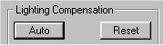
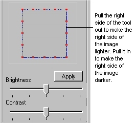

# Using the Lighting tab{#using-the-lighting-tab}

The Lighting tab lets you correct for any gradient that resulted from photographing the texture with uneven lighting.

 ** To compensate for uneven lighting:** 

1. With the image open in the [!DNL Material Repeat] tool in [!DNL Photoshop], click the [!DNL Lighting] tab.
1. Make sure the [!DNL Show Single Tile] option is unchecked.

   

1. Click the **[!UICONTROL Auto]** button to automatically adjust the lighting.

   

   If the Auto adjustment is not sufficient, you can use the [!DNL Lighting] tool (the gray square with blue edges) to make further adjustments. As you make adjustments, click **[!UICONTROL Apply]** to see the results of your changes. If you don't like the result of your changes, click **[!UICONTROL Reset]**, then click **[!UICONTROL Apply]** to return to the initial settings. 

1. Use the following methods to adjust the lighting manually:

       

    * Drag any edge of the tool to make the corresponding side of the image lighter or darker. Dragging outwards makes the image lighter, and dragging inwards makes it darker. 
    * Drag a red point on the blue edge to adjust the lighting from the angle represented by that point. 
    * Adjust the Contrast slider to change the current light angle. 
    * Feather the lighting effect by choosing either or both of the directions ( Left/Right and/or Top/Bottom), then adjusting the slider to indicate the number of pixels to include in the feathering.

1. When the lighting looks satisfactory, go on to [create the final repeat](../../../c-vat-troubleshooting/r-vat-imperfections/t-vat-use-lighting-tab/t-vat-create-final-repeat.md#task-f33d6792ef9647eb828822c7d1624719).
